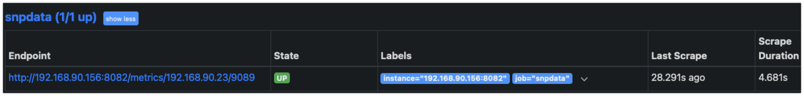

# The SNP Metrics Exporter
This ia a Prometheus exporter for Imagine SNP (Selenio Network Processor) - IP Processor (SMPTE ST-2110) written in Node.js.

On a HTTP `/metrics` request, the exporter will query the Imagine SNP's API for data which it then aggregates and exposes as Prometheus metrics. 


Docker container image: [https://hub.docker.com/r/yannick2110/snp_exporter](https://hub.docker.com/r/yannick2110/snp_exporter)

## Documentation 

- This exporter will listen by default on the port `8080`
- Two arguments are needed :
  - `instance` with the SNP's URL
  - `port` with the SNP's API port (`9089` by default)
- Default API credentials are used if no environnment variables are provided (see *docker-compose-snpexporter-example* example)

## Exported metrics

| API            |  Metrics exported            |
|----------------|------------------------------|
| PTP Status     | Offset, Delay, GMC ID...     |
| Wan Status     | Primary and Secondary links  |
| System Status  | Hardware (PS, Fans, FPGA)    |

## snp_exporter example 

### Route - option 1
`http://localhost:8080/metrics?instance=10.10.10.1&port=9089`

### Route - option 2
`http://localhost:8080/metrics/10.10.10.10/9089`

Will return (short portion of prometheus metrics)

````
# HELP snp_ptp_status snp_ptp_status of the PTP client
# TYPE snp_ptp_status gauge
snp_ptp_status{component="utc_time",unit="ms",app="snp_exporter"} 1713259694000
snp_ptp_status{component="biggest_sys_time_update",unit="ms",app="snp_exporter"} 6573
snp_ptp_status{component="num_sys_time_update",app="snp_exporter"} 7
snp_ptp_status{component="ptp_master_delay",app="snp_exporter"} 0.883
snp_ptp_status{component="ptp_master_offset",app="snp_exporter"} 0.498

# HELP snp_wan_status snp_wan_status of the System
# TYPE snp_wan_status gauge
snp_wan_status{alarmType="wan_alarm",component="errs",network="primary",way="rx",app="snp_exporter"} 0
snp_wan_status{alarmType="wan_alarm",component="over_bandwidth",network="primary",way="rx",app="snp_exporter"} 0
snp_wan_status{alarmType="wan_alarm",component="pkts",network="primary",way="rx",app="snp_exporter"} 8094088
snp_wan_status{alarmType="wan_alarm",component="rate",network="primary",way="rx",unit="Mbps",app="snp_exporter"} 0.02
snp_wan_status{alarmType="wan_alarm",component="config_bw_100G",way="rx",unit="Mbps",app="snp_exporter"} 0
snp_wan_status{alarmType="wan_alarm",component="config_bw_25G_A",way="rx",app="snp_exporter"} 0
snp_wan_status{alarmType="wan_alarm",component="config_bw_25G_B",way="rx",app="snp_exporter"} 0
````

## docker-compose example 

````
version: '3'

services:
    app:
        image: snp-exporter:1.0
        container_name: snp-exporter
        restart: on-failure
        ports:
            - 8082:8080
        environment:
            USERNAME_SNP: "admin"        # Set Username
            PASSWORD_SNP: "password"     # Set Password
````

## Install Steps - SNP Exporter

- Clone the repo - assume you have Docker on the instance you are working on
- run a docker build against the Dockerfile
    - cd to the `dockerfile` and build - example - `docker build -t snp-exporter:1.0.0 .` - build a local image from the docker file and provide a tag of 1.0.0. 
- Create a docker compose file as per the example above. 
- run the compose - `docker compose -f docker-compose-snp-exporter.yml up`
- Open a browser and navigate to the docker host IP, followed by the port you exposed exampole `http://192.168.90.156:8082/` ... now add the SNP target to the url example - `metrics/192.168.90.23/9089` so the full url is `http://192.168.90.156:8082/metrics/192.168.90.23/9089`.
- If successful the SNP metrics are pulled back and shown to you;


## What metrics are included? 

| API            |  Metrics exported            |
|----------------|------------------------------|
| PTP Status     | Offset, Delay, GMC ID...     |
| Wan Status     | Primary and Secondary links  |
| System Status  | Hardware (PS, Fans, FPGA)    |
| Elements       | Running Persona              |

Example metrics:
```
# HELP snp_processorA_personality snp_processorA_personality
# TYPE snp_processorA_personality gauge
snp_processorA_personality{personality="Multiviewer",app="snp_exporter"} 1

# HELP snp_processorB_personality snp_processorB_personality
# TYPE snp_processorB_personality gauge
snp_processorB_personality{personality="Quad Conversion",app="snp_exporter"} 1

# HELP snp_processorC_personality snp_processorC_personality
# TYPE snp_processorC_personality gauge
snp_processorC_personality{personality="Master Control Lite",app="snp_exporter"} 1

# HELP snp_processorD_personality snp_processorD_personality
# TYPE snp_processorD_personality gauge
snp_processorD_personality{personality="Sync",app="snp_exporter"} 1

# HELP snp_ptp_status_all snp_ptp_status_all of the PTP client
# TYPE snp_ptp_status_all gauge
snp_ptp_status_all{clockIdentity="00 90 F9 FF FE 34 8F 40",ptpCtlrState="Locked",ptpMasterIP="2.2.2.2",ptpMasterInterfaceIP="192.168.61.23",ptpMasterPresent="Primary/Secondary",ptpMasterUUID="74-83-EF-FF-FF-19-84-FF",ptpUcipIsMaster="Slave",app="snp_exporter"} 1

# HELP snp_ptp_status snp_ptp_status of the PTP client
# TYPE snp_ptp_status gauge
snp_ptp_status{component="utc_time",unit="ms",app="snp_exporter"} 1729496559000
snp_ptp_status{component="biggest_sys_time_update",unit="ms",app="snp_exporter"} 0
snp_ptp_status{component="num_sys_time_update",app="snp_exporter"} 0
snp_ptp_status{component="ptp_master_delay",app="snp_exporter"} 0.167
snp_ptp_status{component="ptp_master_offset",app="snp_exporter"} -0.791

# HELP snp_wan_status_all snp_wan_status_all of the Wan
# TYPE snp_wan_status_all gauge
snp_wan_status_all{priDns="8.8.8.8",altDns="8.8.4.4",dhcpInfo="",hostname="SNP-2118370072",registrationServer="",registrationServerConnected="",systemServer="",app="snp_exporter"} 1

# HELP snp_wan_status snp_wan_status of the System
# TYPE snp_wan_status gauge
snp_wan_status{alarmType="wan_alarm",component="errs",network="primary",way="rx",app="snp_exporter"} 0
snp_wan_status{alarmType="wan_alarm",component="over_bandwidth",network="primary",way="rx",app="snp_exporter"} 0
snp_wan_status{alarmType="wan_alarm",component="pkts",network="primary",way="rx",app="snp_exporter"} 68066460104
snp_wan_status{alarmType="wan_alarm",component="rate",network="primary",way="rx",unit="Mbps",app="snp_exporter"} 0.02
snp_wan_status{alarmType="wan_alarm",component="config_bw_100G",way="rx",unit="Mbps",app="snp_exporter"} 5461.73
snp_wan_status{alarmType="wan_alarm",component="config_bw_25G_A",way="rx",app="snp_exporter"} 5461.7
snp_wan_status{alarmType="wan_alarm",component="config_bw_25G_B",way="rx",app="snp_exporter"} 0
snp_wan_status{alarmType="wan_alarm",component="config_bw_25G_C",way="rx",app="snp_exporter"} 0
snp_wan_status{alarmType="wan_alarm",component="config_bw_25G_D",way="rx",app="snp_exporter"} 0
snp_wan_status{alarmType="wan_alarm",component="pkts",network="primary",way="tx",app="snp_exporter"} 2050031077691
snp_wan_status{alarmType="wan_alarm",component="rate",network="primary",way="tx",unit="Mbps",app="snp_exporter"} 8721.84
snp_wan_status{alarmType="wan_alarm",component="config_bw_100G",way="tx",unit="Mbps",app="snp_exporter"} 8728.15
snp_wan_status{alarmType="wan_alarm",component="config_bw_25G_A",way="tx",app="snp_exporter"} 0
snp_wan_status{alarmType="wan_alarm",component="config_bw_25G_B",way="tx",app="snp_exporter"} 4360.4
snp_wan_status{alarmType="wan_alarm",component="config_bw_25G_C",way="tx",app="snp_exporter"} 2189
snp_wan_status{alarmType="wan_alarm",component="config_bw_25G_D",way="tx",app="snp_exporter"} 2178.8
snp_wan_status{alarmType="wan_alarm",component="errs",network="secondary",way="rx",app="snp_exporter"} 0
snp_wan_status{alarmType="wan_alarm",component="over_bandwidth",network="secondary",way="rx",app="snp_exporter"} 0
snp_wan_status{alarmType="wan_alarm",component="pkts",network="secondary",way="rx",app="snp_exporter"} 51129111
snp_wan_status{alarmType="wan_alarm",component="rate",network="secondary",way="rx",unit="Mbps",app="snp_exporter"} 0.01
snp_wan_status{alarmType="wan_alarm",component="pkts",network="secondary",way="tx",app="snp_exporter"} 2050015458264
snp_wan_status{alarmType="wan_alarm",component="rate",network="secondary",way="tx",unit="Mbps",app="snp_exporter"} 8721.82

# HELP snp_wan_status_primary snp_wan_status_primary of the Wan
# TYPE snp_wan_status_primary gauge
snp_wan_status_primary{priEthMACaddr="00:90:f9:34:8F:40",priGateway="0.0.0.0",priIpAddr="192.168.61.23",priIpMask="255.255.255.0",priPortInfo="Ethernet51/1",priSwitchInfo="192.168.90.19 - Arista7280",app="snp_exporter"} 1

# HELP snp_wan_status_secondary snp_wan_status_secondary of the Wan
# TYPE snp_wan_status_secondary gauge
snp_wan_status_secondary{secEthMACaddr="00:90:f9:34:8F:41",secGateway="0.0.0.0",secIpAddr="192.168.71.23",secIpMask="255.255.255.0",secPortInfo="Ethernet52/1",secSwitchInfo="192.168.90.19 - Arista7280",app="snp_exporter"} 1

# HELP snp_system_status_hw snp_system_status_hw of the System
# TYPE snp_system_status_hw gauge
snp_system_status_hw{mac0="00:90:f9:34:8F:3E",mac1="00:90:f9:34:8F:3F",serial="2118370072",fwRev="3.0.0.57",hwRev="1.0",app="snp_exporter"} 1

# HELP snp_system_status_hw_alarm snp_system_status_hw_alarm of the System
# TYPE snp_system_status_hw_alarm gauge
snp_system_status_hw_alarm{alarmType="configuration_alarm",component="fpga_1",app="snp_exporter"} 1
snp_system_status_hw_alarm{alarmType="configuration_alarm",component="fpga_2",app="snp_exporter"} 1
snp_system_status_hw_alarm{alarmType="configuration_alarm",component="fpga_3",app="snp_exporter"} 1
snp_system_status_hw_alarm{alarmType="configuration_alarm",component="fpga_4",app="snp_exporter"} 1
snp_system_status_hw_alarm{alarmType="configuration_alarm",component="fpga_5",app="snp_exporter"} 1
snp_system_status_hw_alarm{alarmType="temp_alarm",component="fpga_1",app="snp_exporter"} 1
snp_system_status_hw_alarm{alarmType="temp_alarm",component="fpga_2",app="snp_exporter"} 1
snp_system_status_hw_alarm{alarmType="temp_alarm",component="fpga_3",app="snp_exporter"} 1
snp_system_status_hw_alarm{alarmType="temp_alarm",component="fpga_4",app="snp_exporter"} 1
snp_system_status_hw_alarm{alarmType="temp_alarm",component="fpga_5",app="snp_exporter"} 1
snp_system_status_hw_alarm{alarmType="fan_alarm",component="fpga_1",app="snp_exporter"} 1
snp_system_status_hw_alarm{alarmType="fan_alarm",component="fpga_2",app="snp_exporter"} 1
snp_system_status_hw_alarm{alarmType="fan_alarm",component="fpga_3",app="snp_exporter"} 1
snp_system_status_hw_alarm{alarmType="fan_alarm",component="fpga_4",app="snp_exporter"} 1
snp_system_status_hw_alarm{alarmType="fan_alarm",component="fpga_5",app="snp_exporter"} 1
snp_system_status_hw_alarm{alarmType="fan_alarm",component="front_fan_1",app="snp_exporter"} 1
snp_system_status_hw_alarm{alarmType="fan_alarm",component="front_fan_2",app="snp_exporter"} 1
snp_system_status_hw_alarm{alarmType="fan_alarm",component="front_fan_3",app="snp_exporter"} 1
snp_system_status_hw_alarm{alarmType="fan_alarm",component="front_fan_4",app="snp_exporter"} 1
snp_system_status_hw_alarm{alarmType="ps_alarm",component="ps_1",app="snp_exporter"} 1
snp_system_status_hw_alarm{alarmType="ps_present",component="ps_1",app="snp_exporter"} 1
snp_system_status_hw_alarm{alarmType="fan_alarm",component="ps_1",app="snp_exporter"} 1
snp_system_status_hw_alarm{alarmType="ps_alarm",component="ps_2",app="snp_exporter"} 0
snp_system_status_hw_alarm{alarmType="ps_present",component="ps_2",app="snp_exporter"} 0
snp_system_status_hw_alarm{alarmType="fan_alarm",component="ps_2",app="snp_exporter"} 1
snp_system_status_hw_alarm{alarmType="ps_alarm",component="ps_general",app="snp_exporter"} 1
snp_system_status_hw_alarm{alarmType="ps_hot_swap",component="ps_general",app="snp_exporter"} 0
snp_system_status_hw_alarm{alarmType="fan_alarm",component="ps_general",app="snp_exporter"} 0

# HELP snp_system_status_hw_temp snp_system_status_hw_temp of the System
# TYPE snp_system_status_hw_temp gauge
snp_system_status_hw_temp{alarmType="fan_temp",component="fpga_1",unit="��C",app="snp_exporter"} 60.5
snp_system_status_hw_temp{alarmType="fan_temp",component="fpga_2",unit="��C",app="snp_exporter"} 71.5
snp_system_status_hw_temp{alarmType="fan_temp",component="fpga_3",unit="��C",app="snp_exporter"} 64
snp_system_status_hw_temp{alarmType="fan_temp",component="fpga_4",unit="��C",app="snp_exporter"} 58.5
snp_system_status_hw_temp{alarmType="fan_temp",component="fpga_5",unit="��C",app="snp_exporter"} 61.5
snp_system_status_hw_temp{alarmType="board_temp",component="main_board",unit="��C",app="snp_exporter"} 48.5
snp_system_status_hw_temp{alarmType="board_temp",component="io_board",unit="��C",app="snp_exporter"} 39
snp_system_status_hw_temp{alarmType="qsfp_temp",component="qsfp_primary",unit="��C",app="snp_exporter"} 37.4
snp_system_status_hw_temp{alarmType="qsfp_temp",component="qsfp_secondary",unit="��C",app="snp_exporter"} 42.6

# HELP snp_system_status_hw_speed snp_system_status_hw_speed of the System
# TYPE snp_system_status_hw_speed gauge
snp_system_status_hw_speed{component="front_fan_1",unit="RPM",app="snp_exporter"} 6467
snp_system_status_hw_speed{component="front_fan_2",unit="RPM",app="snp_exporter"} 6362
snp_system_status_hw_speed{component="front_fan_3",unit="RPM",app="snp_exporter"} 6373
snp_system_status_hw_speed{component="front_fan_4",unit="RPM",app="snp_exporter"} 6311

# HELP snp_system_status_qsfp snp_system_status_qsfp of the System
# TYPE snp_system_status_qsfp gauge
snp_system_status_qsfp{alarmType="qsfp_present",network="primary",app="snp_exporter"} 1
snp_system_status_qsfp{alarmType="qsfp_dataValid",network="primary",app="snp_exporter"} 1
snp_system_status_qsfp{vendor_name="INNOLIGHT       ",vendor_pn="TR-FC85S-N00    ",vendor_sn="INIAY3851739    ",network="primary",app="snp_exporter"} 1
snp_system_status_qsfp{alarmType="qsfp_power",network="primary",component="qsfp_link_1",way="rx",unit="dBm",app="snp_exporter"} 0
snp_system_status_qsfp{alarmType="qsfp_power",network="primary",component="qsfp_link_1",way="tx",unit="dBm",app="snp_exporter"} 0
snp_system_status_qsfp{alarmType="qsfp_power",network="primary",component="qsfp_link_2",way="rx",unit="dBm",app="snp_exporter"} 0.3
snp_system_status_qsfp{alarmType="qsfp_power",network="primary",component="qsfp_link_2",way="tx",unit="dBm",app="snp_exporter"} 0.3
snp_system_status_qsfp{alarmType="qsfp_power",network="primary",component="qsfp_link_3",way="rx",unit="dBm",app="snp_exporter"} 0.7
snp_system_status_qsfp{alarmType="qsfp_power",network="primary",component="qsfp_link_3",way="tx",unit="dBm",app="snp_exporter"} 0.7
snp_system_status_qsfp{alarmType="qsfp_power",network="primary",component="qsfp_link_4",way="rx",unit="dBm",app="snp_exporter"} 0.5
snp_system_status_qsfp{alarmType="qsfp_power",network="primary",component="qsfp_link_4",way="tx",unit="dBm",app="snp_exporter"} 0.5
snp_system_status_qsfp{alarmType="qsfp_present",network="secondary",app="snp_exporter"} 1
snp_system_status_qsfp{alarmType="qsfp_dataValid",network="secondary",app="snp_exporter"} 1
snp_system_status_qsfp{vendor_name="INNOLIGHT       ",vendor_pn="TR-FC85S-N00    ",vendor_sn="INHAS5891983    ",network="secondary",app="snp_exporter"} 1
snp_system_status_qsfp{alarmType="qsfp_power",network="secondary",component="qsfp_link_1",way="rx",unit="dBm",app="snp_exporter"} -0.3
snp_system_status_qsfp{alarmType="qsfp_power",network="secondary",component="qsfp_link_1",way="tx",unit="dBm",app="snp_exporter"} -0.3
snp_system_status_qsfp{alarmType="qsfp_power",network="secondary",component="qsfp_link_2",way="rx",unit="dBm",app="snp_exporter"} -0.2
snp_system_status_qsfp{alarmType="qsfp_power",network="secondary",component="qsfp_link_2",way="tx",unit="dBm",app="snp_exporter"} -0.2
snp_system_status_qsfp{alarmType="qsfp_power",network="secondary",component="qsfp_link_3",way="rx",unit="dBm",app="snp_exporter"} -0.5
snp_system_status_qsfp{alarmType="qsfp_power",network="secondary",component="qsfp_link_3",way="tx",unit="dBm",app="snp_exporter"} -0.5
snp_system_status_qsfp{alarmType="qsfp_power",network="secondary",component="qsfp_link_4",way="rx",unit="dBm",app="snp_exporter"} -0.1
snp_system_status_qsfp{alarmType="qsfp_power",network="secondary",component="qsfp_link_4",way="tx",unit="dBm",app="snp_exporter"} -0.1

# HELP snp_system_status_alarm_stat_unique_types snp_system_status_alarm_stat_unique_types of the Wan
# TYPE snp_system_status_alarm_stat_unique_types gauge
snp_system_status_alarm_stat_unique_types{app="snp_exporter"} 8

# HELP snp_system_status_alarm_stat_minor_instances snp_system_status_alarm_stat_minor_instances of the Wan
# TYPE snp_system_status_alarm_stat_minor_instances gauge
snp_system_status_alarm_stat_minor_instances{app="snp_exporter"} 8

# HELP snp_system_status_alarm_stat_major_instances snp_system_status_alarm_stat_major_instances of the Wan
# TYPE snp_system_status_alarm_stat_major_instances gauge
snp_system_status_alarm_stat_major_instances{app="snp_exporter"} 11
```

## Install and Configuration Steps - Prometheus and Grafana

As part of this repo, we have included the Prometheus and Grafana items.

- A `prometheus.yml` file is included you will need to edit this file/job name to include your SNP endpoint details:
```
  - job_name: 'snpdata'  # Separate job if you need a different metrics path
    metrics_path: '/metrics/192.168.90.23/9089'  # Different metrics path
    static_configs:
      - targets: ['192.168.90.156:8082']  # Second target
```

- Review and run the docker compose for the Grafana, Prometheus containers. Node exporter is not need but is listed as part of the compose.
- `docker compose -f docker-compose-prom-graf.yml up -d`
- Navigate to the Prometheus URL and check the target is UP! 


- Browse to Grafana  `http://192.168.90.156:3001` - user = admin password = admin
- Add the Prometheus connection as a new data source
- create a new dashboard and select import. 
- an example SNP dashboard JSON file is provided

